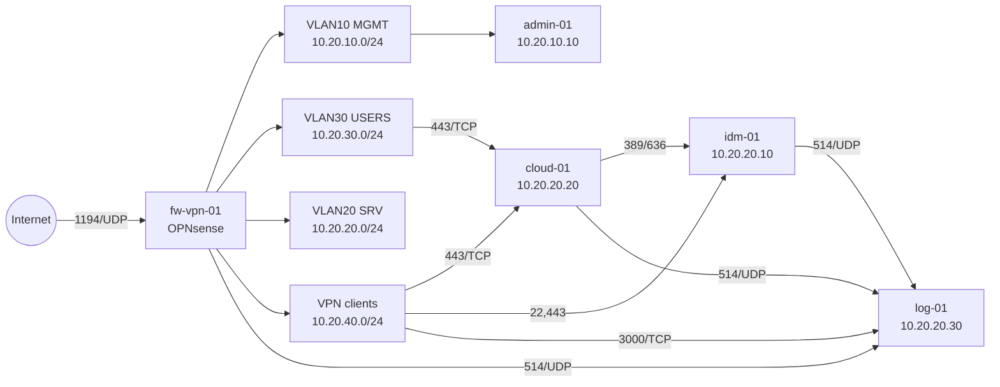

# Plan d'adressage et schema reseau

## Metadonnees

- Version : 1.0
- Statut : cadrage cible
- Auteur : Codex
- Date : 2026-03-27

## Objectif

Definir le plan d'adressage, la segmentation reseau, le sous-reseau VPN et les regles de filtrage minimales pour les sujets 5 et 2.

## Principes retenus

- un pare-feu central `fw-vpn-01` porte l'ensemble des passerelles
- les serveurs sont isoles des postes utilisateurs
- le VPN termine sur le pare-feu et rejoint un sous-reseau dedie
- les flux sont ouverts uniquement selon le besoin de service

## Domaine interne

- domaine logique : `corp.ynov.lab`

## Interfaces et passerelles

| Equipement | Interface | Adresse | Usage |
| --- | --- | --- | --- |
| `fw-vpn-01` | WAN | DHCP / reseau amont | acces Internet |
| `fw-vpn-01` | VLAN10-MGMT | `10.20.10.1/24` | administration |
| `fw-vpn-01` | VLAN20-SRV | `10.20.20.1/24` | serveurs |
| `fw-vpn-01` | VLAN30-USERS | `10.20.30.1/24` | postes internes |
| `fw-vpn-01` | OpenVPN | `10.20.40.1/24` | reseau VPN |

## Reseaux internes

| Reseau | VLAN | Sous-reseau | Usage | Allocation |
| --- | --- | --- | --- | --- |
| Management | 10 | `10.20.10.0/24` | poste admin, administration infra | statique + petit DHCP |
| Serveurs | 20 | `10.20.20.0/24` | VMs projet | statique |
| Utilisateurs | 30 | `10.20.30.0/24` | postes internes et tests | DHCP |
| VPN | 40 | `10.20.40.0/24` | clients OpenVPN | pool dynamique |

## Adresses reservees

| Hote | Adresse | Role |
| --- | --- | --- |
| `fw-vpn-01` | `10.20.10.1` | passerelle management |
| `fw-vpn-01` | `10.20.20.1` | passerelle serveurs |
| `fw-vpn-01` | `10.20.30.1` | passerelle utilisateurs |
| `fw-vpn-01` | `10.20.40.1` | passerelle VPN |
| `admin-01` | `10.20.10.10` | poste d'administration |
| `idm-01` | `10.20.20.10` | annuaire LDAP |
| `cloud-01` | `10.20.20.20` | Nextcloud |
| `log-01` | `10.20.20.30` | logs et supervision |

## Pools DHCP recommandes

| Reseau | Plage DHCP |
| --- | --- |
| `10.20.10.0/24` | `10.20.10.100` a `10.20.10.149` |
| `10.20.30.0/24` | `10.20.30.100` a `10.20.30.199` |
| `10.20.40.0/24` | `10.20.40.50` a `10.20.40.150` |

## Flux et regles de base

### WAN vers pare-feu

| Source | Destination | Port / Proto | Action | Justification |
| --- | --- | --- | --- | --- |
| Internet | `fw-vpn-01` | `1194/UDP` | allow | acces OpenVPN |
| Internet | autres reseaux internes | any | deny | aucune exposition directe |

### VLAN30-USERS vers VLAN20-SRV

| Source | Destination | Port / Proto | Action | Justification |
| --- | --- | --- | --- | --- |
| `10.20.30.0/24` | `10.20.20.20` | `443/TCP` | allow | acces utilisateurs a Nextcloud |
| `10.20.30.0/24` | `10.20.20.0/24` | `22/TCP`, `389/TCP`, `636/TCP` | deny | pas d'acces admin ou annuaire direct |
| `10.20.30.0/24` | `10.20.20.0/24` | any | deny | fermeture par defaut |

### VLAN10-MGMT vers VLAN20-SRV

| Source | Destination | Port / Proto | Action | Justification |
| --- | --- | --- | --- | --- |
| `10.20.10.0/24` | `10.20.20.0/24` | `22/TCP`, `443/TCP` | allow | administration des VMs |
| `10.20.10.0/24` | `10.20.20.30` | `3000/TCP` | allow | acces Grafana si non reverse-proxy |

### Serveurs entre eux

| Source | Destination | Port / Proto | Action | Justification |
| --- | --- | --- | --- | --- |
| `cloud-01` | `idm-01` | `389/TCP`, `636/TCP` | allow | authentification LDAP |
| `fw-vpn-01` | `log-01` | `514/UDP` | allow | envoi syslog |
| `idm-01` | `log-01` | `514/UDP` | allow | envoi syslog |
| `cloud-01` | `log-01` | `514/UDP` | allow | envoi syslog |

### VPN vers ressources internes

| Source | Destination | Port / Proto | Action | Justification |
| --- | --- | --- | --- | --- |
| `10.20.40.0/24` | `fw-vpn-01` | `53/TCP-UDP` | allow | DNS interne pour clients VPN |
| groupe `users_nomades` | `cloud-01` | `443/TCP` | allow | acces cloud prive |
| groupe `admins_it` | `cloud-01` | `22/TCP`, `443/TCP` | allow | administration et usage |
| groupe `admins_it` | `idm-01` | `22/TCP`, `443/TCP` | allow | administration annuaire |
| groupe `admins_it` | `log-01` | `3000/TCP` | allow | consultation journaux |
| `10.20.40.0/24` | `10.20.20.0/24` | any | deny par defaut | segmentation VPN |

## Schema reseau

Le schema source est stocke dans `docs/architecture/schema-reseau-global.mmd`.

## Remarques d'implementation

- si le lab ne permet pas les VLANs, les reseaux peuvent etre simules par plusieurs cartes virtuelles ou reseaux internes distincts
- le plan d'adressage reste valable meme dans un environnement de test local
- `fw-vpn-01` peut aussi jouer le role de serveur DHCP et de resolv DNS interne
